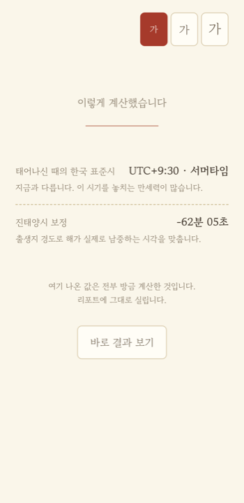
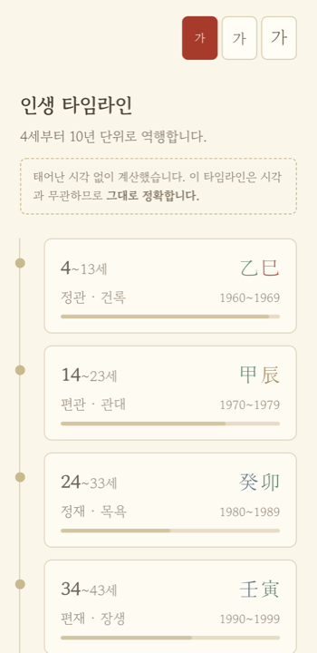
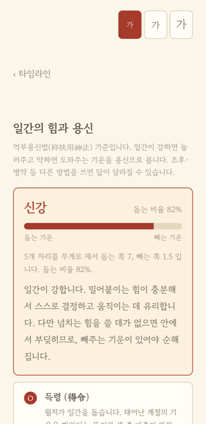
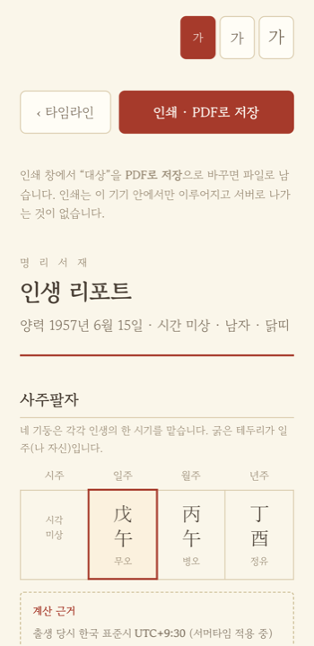
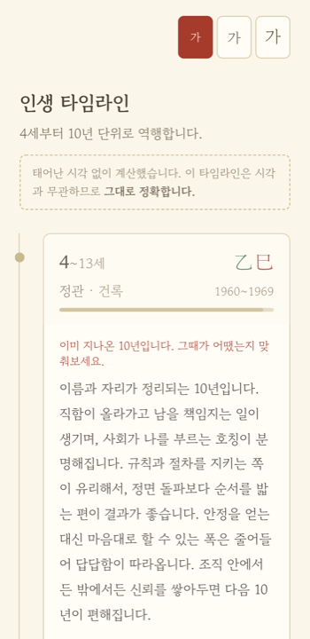

# 명리서재

**인생을 10년 단위로 펼쳐보는 사주 사이트.**
겁주지 않고, 점수 매기지 않고, 생년월일을 가져가지 않는다.

<sub>React 19 · TypeScript · Vite · Tailwind v4 · Zustand · Vitest · Playwright · MCP</sub>

---

대부분의 사주 앱은 "오늘의 운세 87점"에 집중한다. 그런데 사람들이 진짜 소름
돋는 순간은 오늘 점수가 아니라 **자기 과거가 설명될 때**다. 인생을 10년 단위로
펼쳐놓고 "여기가 당신의 25~34세, 편관 대운" 이라고 짚어주면 사람들은 자기 인생을
그 표에 대조한다.

그리고 이건 **알고리즘이 정확해야만 성립하는 유일한 기능**이다. 오늘 운세는
하루 틀려도 아무도 모르지만, 대운수가 1년 어긋나면 타임라인이 통째로 밀린다.

## 화면

| 첫 화면 | 계산 근거 | 인생 타임라인 |
|:--:|:--:|:--:|
|  |  |  |
| 무엇을 **하지 않는지** 먼저 말한다.<br>가운데 낙관은 방금 계산한 오늘의 일진 | 가짜 진행 막대 대신<br>**실제 계산한 값**을 한 줄씩 | 결과의 첫 화면이 사주팔자표가 아니라<br>대운 타임라인이다 |

| 궁합 | 상세 풀이 | 인생 리포트 |
|:--:|:--:|:--:|
|  |  |  |
| 점수를 내지 않는다.<br>**없는 오행이 아니라 필요한 오행**으로 본다 | 궁위·오행 균형·용신을<br>결과 화면에 쌓지 않고 갈라놓았다 | 계산 근거를 같이 싣는<br>A4 인쇄 문서 |

| 대운 펼침 | 생년월일은 어디로 가나요 | 없는 주소 |
|:--:|:--:|:--:|
|  |  |  |
| 지나온 10년에 **직접 적는다**.<br>맞다고 말해주는 대신 확인하게 한다 | 법률 문서 말투를 쓰지 않는다.<br>**불리한 사실도 빼지 않는다** | 링크가 잘렸을 때를 짚어준다 |

## 기술 스택

| | |
|---|---|
| **언어 · 빌드** | TypeScript 5.9 (`strict` + `noUncheckedIndexedAccess` + `verbatimModuleSyntax`) · Vite 6 |
| **UI** | React 19 · Tailwind CSS v4 (`@theme` 토큰) · 애니메이션은 **CSS 만** (라이브러리 0바이트) |
| **상태** | Zustand 5 — 라우팅도 상태로 (URL 에 생년월일을 안 남기려고) |
| **도메인 엔진** | 직접 구현 (`core/pillars.ts`) + 직접 생성한 절기표 (23.6KB) |
| **음력** | `korean-lunar-calendar` — 한국천문연구원 자료 |
| **관측** | `@sentry/react` — 생년월일 세탁 게이트를 통과해야만 나간다 |
| **테스트** | Vitest 3 (**556**) · Playwright 1.62 (**238**, 모바일·데스크톱·움직임 3프로젝트) |
| **검증 도구** | astronomy-engine (천체력) · lunar-javascript · manseryeok · **Python + skyfield/JPL DE421** |
| **통합** | Model Context Protocol SDK — 엔진을 MCP 도구 6개로 노출 |
| **CI** | GitHub Actions — tzdata 자가진단 → 타입 → 빌드 → 테스트 → E2E → 골든 재생성 diff |

### 이 프로젝트에서 실제로 다룬 것

- **시간대·역법** — IANA tzdata, 진태양시, 두 타임라인 분리
- **천체 계산** — 태양 겉보기 황경, 삭(朔), 中氣로 윤달 판정
- **데이터 인코딩** — 절기 4,824개를 델타 + 36진수로 23.6KB
- **번들 예산 관리** — 진입 청크 250KB 를 CI 가 지킨다
- **프라이버시 엔지니어링** — 개인정보가 샐 수 있는 네 경로를 막고, 막혔는지를 테스트가 확인
- **접근성** — 용어를 설명하는 화면(관객이 사주 용어를 모른다), WCAG AA 색 대비를 **토큰에서 직접 계산해 테스트**, `prefers-reduced-motion`, 큰 글씨 모드, 44px 터치 타깃
- **검증 설계** — 정답지가 없는 대상(용신·신살)을 어떻게 검증하는가

## 한눈에

| | |
|---|---|
| 절기를 천체력과 대조 | 3,624 표본 · 최대 편차 **55.8초** |
| 일주를 율리우스일로 검증 | **73,414일** · 상수 하나로 전부 설명 |
| 구조 규칙 전수 (오호둔·오자시두법) | 11,172건 · 불일치 **0** |
| 파이썬 독립 구현과 대조 | 위상 상수를 **스스로 도출** · 네 기둥 불일치 0 |
| 진입 청크 / 엔진 청크 | 250KB 예산 / **100KB** (계산 라이브러리 제거 후) |
| 작업 중 찾은 실제 버그 | **중국 음력을 쓰고 있었다** (달의 3.6%에서 하루 어긋남) |
| 말과 행동이 달랐던 곳 | 처리방침은 "아무 데도 안 보낸다"인데 **구글 폰트를 부르고 있었다** |

## 더 읽기

| 문서 | 내용 |
|---|---|
| [만세력 정확도](docs/accuracy.md) | 한국 표준시 이력 · 절기 · 일주 · 한국 음력 · 파이썬 검증 |
| [구조와 게이트](docs/architecture.md) | 설계 결정 · 번들 분할 · **배포 게이트 전 단계** · 손으로 돌리는 검증 |
| [해석](docs/interpretation.md) | 용신 · 신살 · **궁합** · **오늘/신년** · 리포트 · 대조표 · **용어** |
| [화면과 움직임](docs/ux.md) | 첫 화면 · 화면 구조 · 애니메이션 · 공유 링크 · **색 대비** · **폰트 자체 호스팅** |
| [MCP 서버](docs/mcp.md) | 엔진을 다른 AI 에게 도구로 여는 법 |

## 빠르게 돌려보기

```bash
pnpm install
pnpm dev                # 개발 서버
pnpm gate               # 타입 + MCP 빌드 + 단위 테스트
pnpm test:e2e           # Playwright
pnpm build:mcp          # MCP 서버 → dist-mcp/server.js
pnpm verify:python 150  # 파이썬 독립 구현과 대조 (환경 필요)
pnpm shots              # 문서용 스크린샷 갱신
pnpm docs:sync          # README 의 테스트 수를 실제와 맞춤
pnpm fonts              # 웹폰트를 우리 쪽으로 다시 받기
pnpm gen:terms          # 절기표 다시 생성
```

## 아직 안 한 것

- **KASI 공식 대조** — 절기는 천체력으로 직접 검증했다(위 "절기" 절). 그 위에
  공식 기관 값까지 맞춰보는 건 `pnpm verify:kasi` 로 남겨뒀는데,
  공공데이터포털 키 발급이 사람 손을 타는 절차라 아직 실키로 못 돌려봤다.
  응답 형태를 문서로만 보고 맞췄으므로 처음 돌릴 때 `--raw` 로 확인이 필요하다
- **파이썬 검증의 자동화** — `pnpm verify:python` 은 손으로 돌린다. 천체력
  17MB 를 CI 에 매달 만하지는 않아서, 큰 변경 뒤에 사람이 한 번 돌리는
  절차로 남겨뒀다
- **1911년 이전 음력** — 한국 음력 자료가 그 구간에서 KST 규칙과 여덟 번
  어긋난다. 대한제국이 표준시를 정하기 전이라 어느 기준이 맞는지부터
  정해야 한다. 1900~1911년생은 지금도 계산되지만 음력 입력의 정밀도가
  그 뒤 구간보다 낮다
